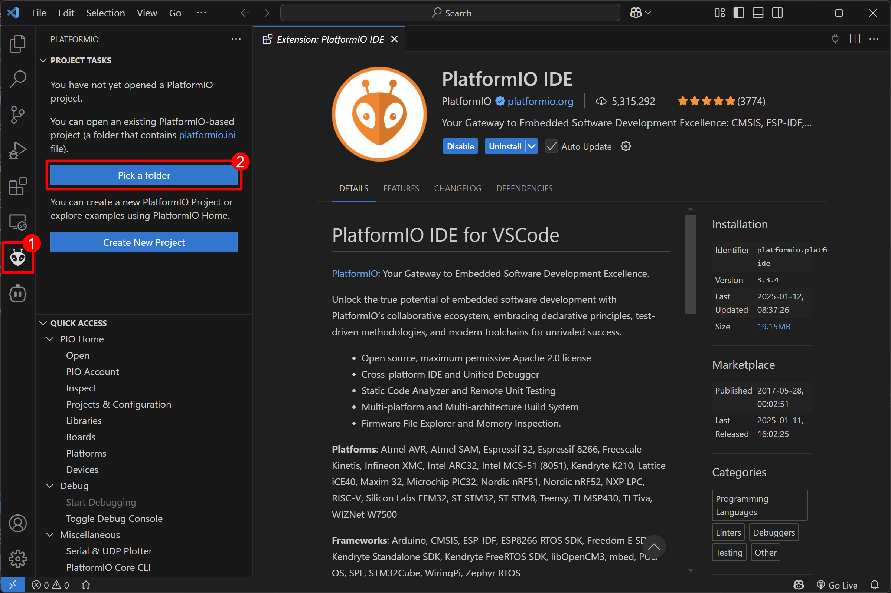

# Waveshare ESP32 S3 Touch LCD 2.1"

English version [ here. ](./README.en.md)

## Einleitung

In dieser Anleitung werden wir mit einem Touch-Display arbeiten, das von einem ESP32 Mikrocontroller gesteuert wird. Mit der LVGL (Light and Versatile Graphics Library) kannst du schnell und einfach moderne Benutzeroberflächen erstellen - von einzelnen Buttons bis hin zu komplexen Dashboards.

## LVGL

LVGL ist eine benutzerfreundliche Grafikbibliothek, die viele fertige UI-Elemente wie Buttons, Slider, Textfelder und Charts bereitstellt. Diese Elemente können einfach auf dem Display platziert und nach deinen Wünschen angepasst werden.

## Quick Start Guide

### Was du brauchst

1. **Hardware**

   - Waveshare ESP32-S3 LCD 2.1" Display
   - USB-C Kabel

2. **Software**
   - Visual Studio Code
   - PlatformIO Erweiterung für VS Code

### Code herunterladen

Du hast zwei Möglichkeiten, den Code herunterzuladen:

1. **Als ZIP-Datei**

   - Gehe auf die Projektseite auf GitHub
   - Klicke auf den grünen "Code" Button
   - Wähle "Download ZIP"
   - Entpacke die ZIP-Datei in einen Ordner deiner Wahl

   

2. **Mit Git** (optional)
   - Falls du Git installiert hast, kannst du das Repository auch direkt klonen

### Setup in 5 Minuten

1. **Visual Studio Code installieren** (wenn noch nicht vorhanden)

   - Gehe zu [code.visualstudio.com](https://code.visualstudio.com/)
   - Lade VS Code herunter und installiere es
   - Starte VS Code

2. **PlatformIO installieren**

   - Öffne die Erweiterungen in VS Code (Ctrl+Shift+X)
   - Suche nach "PlatformIO"
   - Installiere "PlatformIO IDE"
   - Warte bis die Installation abgeschlossen ist

3. **Projekt öffnen**

   - Öffne VS Code
   - Klicke auf das PlatformIO-Symbol an der linken Seite (falls das Symbol nicht da ist Erweiterung kurz deaktivieren und wieder aktivieren)
   - Wähle "Open Project"
   - Navigiere zum Projektordner und öffne ihn

     

4. **Board anschließen**

   - Stecke das USB-C Kabel in dein Board
   - Verbinde es mit deinem Computer
   - Warte kurz bis Windows das Board erkennt

5. **Code hochladen**
   - Klicke unten in der Leiste auf den Pfeil nach rechts (→)
   - Warte bis der Upload abgeschlossen ist
   
   - wenn alles geklappt hat sollte auf dem screen ein Button zu sehen sein

### Kurze Platform IO Einführung

PlatformIO ist eine Entwicklungsumgebung für Mikrocontroller, die in VS-Code funktioniert. Dein Code ist unter dem ordner src/main.cpp zu finden. Hier kannst du deinen Code anpassen und erweitern.

Hochladen geht wie oben beschrieben und einen Seriellen Monitor hat du 2 Icons weiter rechts auf dem Stecker Symbol. 

### Häufige Probleme

**Board wird nicht erkannt:**

1. Drücke den RESET-Knopf auf dem Board
2. Überprüfe das USB-Kabel
3. Probiere einen anderen USB-Port

**Upload funktioniert nicht:**

1. Halte BOOT gedrückt
2. Drücke kurz RESET
3. Lasse BOOT los
4. Versuche den Upload erneut

### Hilfe bekommen

- Frag deine Dozenten
- Schau in die [Waveshare Wiki](https://www.waveshare.com/wiki/ESP32-S3-Touch-LCD-2.1)
- frag ChatGPT :)

## Für Interessierte: Technische Details

### Warum PlatformIO statt Arduino IDE?

PlatformIO ist eine professionelle Entwicklungsumgebung mit vielen Vorteilen:

- Bessere Code-Vervollständigung
- Einfachere Bibliotheksverwaltung
- Schnelleres Kompilieren
- Moderne Entwicklungsumgebung

### Wie arbeitet LVGL mit den Treibern?

LVGL arbeitet auf mehreren Ebenen mit der Hardware zusammen:

1. **Display-Treiber (ST7701)**

   - LVGL kommuniziert über einen Display-Treiber mit dem LCD
   - Der Treiber wandelt die LVGL-Grafikbefehle in Hardware-spezifische Kommandos um
   - Pixel-Daten werden über SPI/RGB an das Display gesendet

2. **Touch-Controller (CST820)**

   - Der Touch-Controller erfasst Berührungen auf dem Display
   - Er meldet die X/Y-Koordinaten über I2C an LVGL
   - LVGL verarbeitet diese Eingaben und leitet sie an die UI-Elemente weiter

3. **LVGL Display Driver**

   - Verbindet LVGL mit dem ST7701 Display-Controller
   - Stellt den Framebuffer bereit
   - Kümmert sich um die Bildaktualisierung (Display Refresh)

4. **Zusammenspiel**
   - LVGL zeichnet UI-Elemente in den Framebuffer
   - Der Display-Treiber überträgt den Buffer an das LCD
   - Touch-Eingaben werden von unten nach oben weitergereicht
   - Dies ermöglicht eine flüssige und reaktionsschnelle Benutzeroberfläche

### Weiterführende Links

- [LVGL Dokumentation](https://docs.lvgl.io/) - Für UI-Entwicklung
- [ESP32-S3 Dokumentation](https://docs.espressif.com/projects/esp-idf/en/latest/esp32s3/index.html)
- [PlatformIO Docs](https://docs.platformio.org/)
